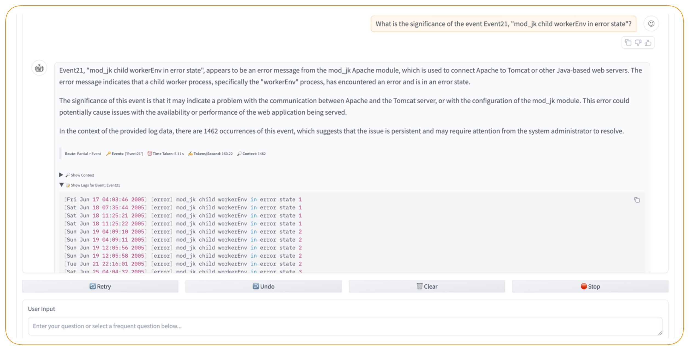

# LLMLogAnalyzer

LLMLogAnalyzer is proposed as a novel clustering-based log analysis chatbot that leverages LLMs and Machine Learning (ML) algorithms. It's designed to help developers and system administrators better understand and troubleshoot their systems through natural language interaction.

## Features

- **Intelligent Log Parsing**: Supports multiple log formats including HDFS, Hadoop, Spark, Zookeeper, and many more
- **Natural Language Querying**: Ask questions about your logs in plain English
- **Log Template Extraction**: Automatically identifies and clusters similar log patterns
- **Contextual Analysis**: Provides detailed insights about log events and their relationships
- **Flexible Search**: Search through logs using keywords or specific event IDs
- **Streaming Responses**: Real-time analysis and response generation

## Supported Log Types

The system supports a wide range of log formats including:

- HDFS
- Hadoop
- Spark
- Zookeeper
- BGL
- HPC
- Thunderbird
- Windows
- Linux
- Android
- HealthApp
- Apache
- Proxifier
- OpenSSH
- OpenStack
- Mac

## Requirements

- Python 3.x
- Required Python packages (to be listed in requirements.txt)
- Access to an LLM API (configured in settings.py)

## Installation

1. Clone the repository:

```bash
git clone https://github.com/yourusername/LLMLogAnalyzer.git
cd LLMLogAnalyzer
```

2. Install dependencies:

```bash
pip install -r requirements.txt
```

3. Configure your settings in `settings.py`

## Usage

### Web Interface

1. Start the LLMLogAnalyzer server:

```bash
jupyter notebook llm_log_analyzer.ipynb
```

Then run all cells in the notebook to start the server.

2. Open your web browser and navigate to the Gradio interface (typically at http://localhost:7860)

3. Upload your log file:

   - Click the "Upload" button in the web interface
   - Select your log file
   - Wait for the file to be processed

4. Start the conversation:
   - Once your log file is uploaded and processed, you can start asking questions about your logs
   - Type your questions in the chat interface
   - The system will analyze your logs and provide detailed responses

<div align="center">
  <kbd>
    
  </kbd>
</div>

## Evaluation

LLMLogAnalyzer includes a comprehensive evaluation framework to assess its performance across different log types and compare it with existing log analysis methods.

### Running Evaluations

#### Prerequisites

Ensure the evaluation dataset is available:

- The evaluation requires `evaluate/results.xlsx` to be present in the evaluate folder
- This file contains the benchmark datasets for Linux, Apache, Windows, and Mac log types

#### 1. Basic Evaluation

Run the main evaluation script to test performance across multiple log datasets:

```bash
python3 evaluate/evaluate.py
```

#### 2. Output Structure

After running the evaluation, you'll find results in the `evaluate/outputs/` folder:

```
evaluate/outputs/
├── Linux/
│   ├── linux_heatmaps.png
│   └── linux_heatmaps.png
├── Apache/
│   ├── apache_metrics.csv
│   └── apache_heatmaps.png
├── Windows/
│   ├── windows_metrics.csv
│   └── windows_heatmaps.png
├── Mac/
│   ├── mac_metrics.csv
│   └── mac_heatmaps.png
```

Each subfolder contains:

- **CSV file**: Detailed performance metrics
- **PNG file**: Visual representation of results

#### 3. Generate Average Performance Metrics

Calculate overall performance across all log types:

```bash
python3 evaluate/average.py
```

This generates:

- `evaluate/outputs/average_heatmaps.png`: Visual heatmap of average performance
- `evaluate/outputs/average_metrics.csv`: Numerical summary of average metrics

#### 4. Statistical Analysis

Generate boxplot visualizations for statistical analysis:

```bash
python3 evaluate/boxplot_v2.py
```

Output: `evaluate/outputs/boxplots/boxplot.png`

#### 5. Comparative Analysis

Compare LLMLogAnalyzer's performance against other methods:

```bash
python3 evaluate/outperforms.py
```

Output: `evaluate/outputs/outperforms.txt` - detailed comparison results

### Evaluation Metrics

The evaluation framework measures:

- **Parsing Accuracy**: How well the system identifies log templates
- **Clustering Quality**: Effectiveness of grouping similar log entries
- **Query Response Accuracy**: Correctness of natural language query responses
- **Processing Speed**: Time efficiency for different log sizes
- **Memory Usage**: Resource consumption during analysis

### Interpreting Results

- **Heatmaps**: Show performance patterns across different log types and metrics
- **Boxplots**: Display statistical distribution of performance metrics
- **Comparison Report**: Highlights where LLMLogAnalyzer outperforms existing solutions

### Benchmark Datasets

The evaluation uses the `evaluate/results.xlsx` file which contains standard log analysis datasets to ensure reproducible and comparable results across different systems and research approaches. This Excel file includes multiple sheets corresponding to different log types (Linux, Apache, Windows, Mac) with ground truth data for evaluation.

## Project Structure

- `query.py`: Main query handling and response generation
- `parser.py`: Log parsing and template extraction
- `router.py`: Query routing and processing
- `settings.py`: Configuration settings
- `utils.py`: Utility functions
- `config.py`: Log format configurations
- `drain.py`: Log template extraction algorithm
- `prompts.py`: LLM prompt templates
- `evaluate/`: Evaluation framework and scripts
  - `evaluate.py`: Main evaluation script
  - `average.py`: Average performance calculation
  - `boxplot_v2.py`: Statistical visualization
  - `outperforms.py`: Comparative analysis
  - `outputs/`: Generated evaluation results

## Acknowledgments

- Based on the LOGPAI project (https://github.com/logpai)
- Uses the Drain algorithm for log template extraction
